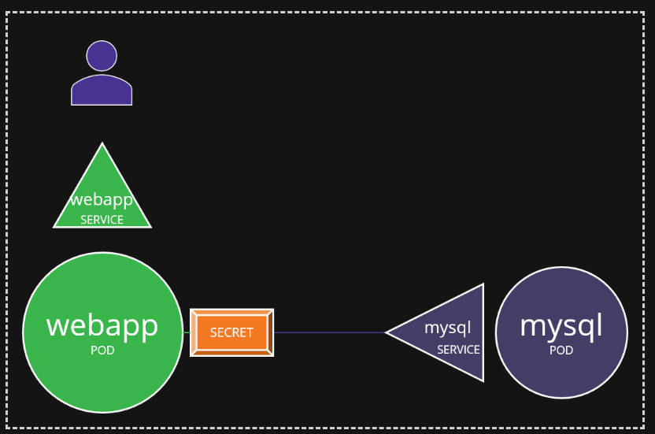

# Secrets
- `echo -n 'your-string' | base64`
- `echo 'your-base64-string' | base64 --decode`


- `kubectl create secret generic my-opaque-secret --from-literal=username=username --from-literal=password=password`
```yaml
apiVersion: v1
kind: Secret
metadata:
  name: mysecret
type: Opaque # default type, can store arbitrary key-value pairs
data:
    username: yourusername # this wont work unless you base64 encode it and store the encoded value
    password: XxX
```

- `kubectl create secret docker-registry my-docker-registry-secret --docker-username=username --docker-password=password --docker-email=email@example.com --docker-server=docker.io` 
```yaml
apiVersion: v1
kind: Secret
metadata:
  name: mysecret
type: kubernetes.io/dockerconfigjson # can store docker-registry, tls, or opaque secrets
data:
    .dockerconfigjson: <base64 encoded docker config json>
```

- `kubectl create secret generic my-service-account-token-secret --type=kubernetes.io/service-account-token --from-literal=token=my-token`
```yaml
apiVersion: v1
kind: Secret
metadata:
  name: my-service-account-token-secret 
  annotations:
    kubernetes.io/service-account.name: my-service-account # specify the name of the service account
type: kubernetes.io/service-account-token # used to store service account tokens
```


- Question
- This image shows the architecture of using a secret to keep sensitive information (mysql pod) from being accessed without the proper secret key. 

- `k create secret generic db-secret --from-literal=DB_Host=sql01 --from-literal=DB_User=root --from-literal=DB_Password=password123`

```yaml
apiVersion: v1
data:
  DB_Host: c3FsMDE=
  DB_Password: cGFzc3dvcmQxMjM=
  DB_User: cm9vdA==
kind: Secret
metadata:
  name: db-secret
  namespace: default
type: Opaque
```

- setup pod
```yaml
---
apiVersion: v1 
kind: Pod 
metadata:
  labels:
    name: webapp-pod
  name: webapp-pod
  namespace: default 
spec:
  containers:
  - image: kodekloud/simple-webapp-mysql
    imagePullPolicy: Always
    name: webapp
    envFrom: # used to populate the environment variables from secrets or configmaps
    # configMapRef: # used to reference a configmap
    - secretRef:
        name: db-secret
```
