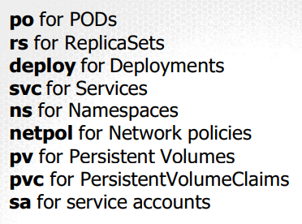

# Important Commands (Imperative Commands)
- `kubectl create pod <pod-name> --image=<image-name> -n <namespace> --restart=Never --dry-run=client --port=80 --labels=app=myapp --requests='cpu=100m,memory=256Mi' --limits='cpu=200m,memory=512Mi' -o yaml > pod.yaml`
- `--dry-run=client` - does not create the pod, just outputs the yaml
- remember to use `create <resource>` with `dry-run` and `-o yaml > file.yaml` to generate the yaml
- `alias k=kubectl`
- Root privileges can be obtained by running `sudo -i`.

- `o wide` - to get IP addresses and nodes
- `--rm` for temporary containers

- kubectl config use-context <context-name> 
  - switch between contexts (clusters, users, namespaces)
  - kubectl config set-context <context-name> --cluster=<cluster-name> --user=<user-name> --namespace=<namespace>
    - defines a context you can switch to
    - recommend naming the context by the question on the exam like q1 --cluster=q1 --user=q1 --namespace=q1

- sh into a pod
  - `kubectl exec -it <pod-name> -- sh` might need `/bin/sh`


# Versioning
## /v1
- pods, services, namespaces, rc, endpoints, events, nodes, bindings, PV, PVC, configmaps, secrets, services.

## /v1/apps
- deployments, replicasets, statefulsets, daemonsets.

## /batch/v1
- jobs, cronjobs
## rbac.authorization.k8s.io/v1
- roles, rolebindings, clusterroles, clusterrolebindings

# Logging
- `kubectl logs -f <pod-name> <container-name>`

# Full Deployment (Pod with all the bells and whistles)
```yaml
apiVersion: apps/v1
kind: Deployment
metadata:
  name: myapp
spec:
  replicas: 3
  selector:
    matchLabels:
      app: myapp
  template:
    metadata:
      labels:
        app: myapp
    spec:
      # kubectl create serviceaccount my-service-account (bot account)
      # setup token for service account Configuration/serviceAccounts.md
      securityContext: # applied to pod or container level (container level takes precedence)
        runAsUser: 1000 # all processes in the container will run as this user
        capabilities:
          add: ["MAC_ADMIN"] # allows for container to perform Mandatory Access Control operations
        allowPrivilegeEscalation: false # prevents the container from gaining more privileges than it started with
      serviceAccountName: my-service-account # provides the pod with AuthN/AuthZ (tokens, roles, secrets)
      volumes:
      - name: mypodvolume
        persistentVolumeClaim:
          claimName: mypvc
            # kubectl label nodes <node-name> disktype=ssd
      affinity:
          nodeAffinity:
              requiredDuringSchedulingIgnoredDuringExecution:
                  nodeSelectorTerms:
                  - matchExpressions:
                      - key: disktype
                        operator: In
                        values:
                        - ssd
      # kubectl label nodes <node-name> disktype=ssd
      nodeSelector:
          disktype: ssd
      # kubectl taint nodes <node-name> ssd=value:NoSchedule
      # if the toleration is the same as the taint, the pod will be scheduled on the node
      tolerations:
      - key: "ssd"
        operator: "Equal"
        value: "value"
        effect: "NoSchedule"
      initContainers:
      - name: init-myservice
        image: busybox
        command: ['sh', '-c', 'until nslookup myservice; do echo waiting for myservice; sleep 2; done;']
        
      # this covers all the variables needed for test on the container 
      containers:
      - name: nginx-container
        image: nginx
        volumeMounts:
        - mountPath: /opt # where on the container the volume will be mounted
          name: mypodvolume # name of the volume (pod.spec.volumes.name)
        ports:
        - containerPort: 80 # port that the service will target
        command: ["/bin/sh", "-c", "echo Hello Kubernetes! && sleep 3600"]
        readinessProbe:
          httpGet: # web server
            path: /index.html
            port: 80 # port that the service will target
          tcpSocket: # database connection
            port: 3306 
          exec: # script
            command:
            - cat
            - /app/is_ready
        livenessProbe:
          httpGet:
            path: /index.html
            port: 80
          tcpSocket:
            port: 3306
          exec:
            command:
            - cat
            - /app/is_alive
        resources:
          limits:
            memory: "128Mi"
            cpu: "500m"
          requests:
            memory: "64Mi"
            cpu: "200m" # 200m or 0.2 cores
        env:
        - name: MYVAR
          valueFrom:
            configMapKeyRef:
              name: mysecret
              key: mykey
      

---
apiVersion: v1
kind: PersistentVolume
metadata:
  name: mypod-pv
spec:
    capacity:
        storage: 1Gi
    accessModes:
        - ReadWriteOnce
    hostPath:
        path: /tmp/data
---
apiVersion: v1
kind: PersistentVolumeClaim
metadata:
  name: mypod-pvc
spec:
    accessModes:
        - ReadWriteOnce
    resources:
        requests:
            storage: 1Gi
    # use matchLabels or volumeName to bind the PVC to a PV
    selector:
        matchLabels:
            app: myapp
    # or 
    volumeName: mypod-pv
---
apiVersion: v1
kind: Service
metadata:
  name: myNodeService # expose the service to the outside world, can use LoadBalancer for cloud providers 
spec:
    type: NodePort
    selector:
        app: myapp
    ports:
        - protocol: TCP
          port: 80 # port on the service
          targetPort: 80 # port on the pod
          nodePort: 30080 # port that can be accessed from outside the cluster (192.168.2:30080) 
---
apiVersion: v1
kind: Service
metadata:
  name: myClusterService # expose the service to the cluster
spec:
    type: ClusterIP
    selector:
        app: myapp
    ports:
        - protocol: TCP
          port: 80
          targetPort: 80
---
apiVersion: v1
kind: ConfigMap
metadata:
  name: mysecret # same name as the pod.spec.containers.env.valueFrom.configMapKeyRef.name
data:
    mykey: myvalue # mykey is the name of the key from the pod. myvalue is the value of the key 
---
apiVersion: batch/v1
kind: Job
metadata:
  name: math-add-job
spec:
  completions: 3
  parallelism: 3
  template:
    spec:
      containers:
      - name: math-add
        image: ubuntu
        command: ['expr', '3', '+', '2']
      restartPolicy: Never
  backoffLimit: 4 
---
apiVersion: batch/v1beta1
kind: CronJob
metadata:
  name: reporting-cron-job
spec:
  schedule: "*/5 * * * *"
  jobTemplate:
    spec:
      completions: 1
      parallelism: 1
      template:
        spec:
          containers:
          - name: reporting-container
            image: my-reporting-image
            command: ["generate-report"]
          restartPolicy: OnFailure
```


Review Ingress, Network Policies, directly



