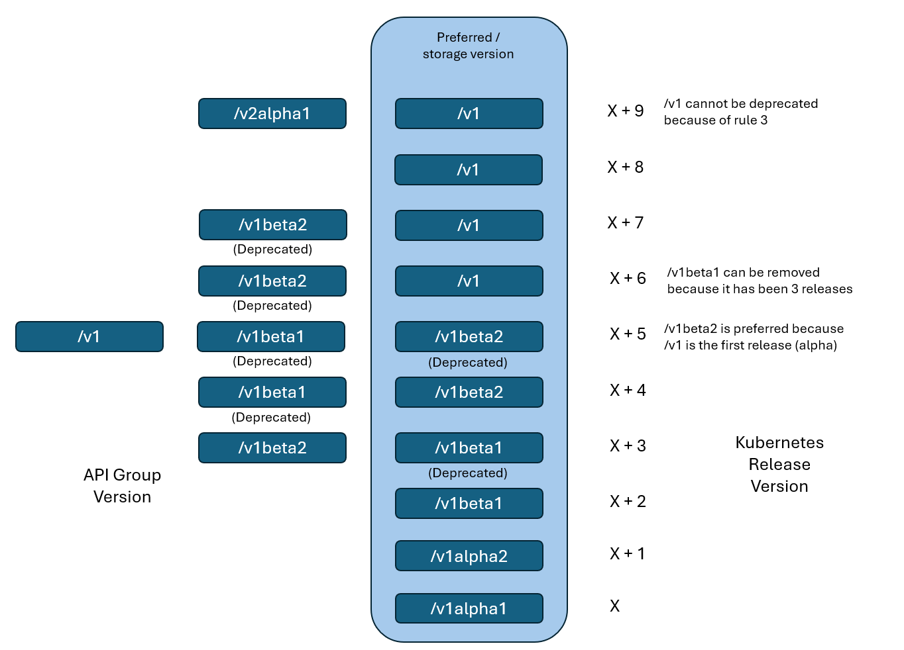

# API Versions
- /apps has many versions, each with its own API.
    - /apps/v1alpha1 is alpha.
        - when an API is first developed and merged to the kubernetes codebase for the very first time, it is marked as alpha.
        - may lack features, may have bugs, may not be stable.
        - also may be removed in the future. Really just for testing and providing feedback.
        - this api group is not enabled by default.
            - if you try to create a resource in this group, you will get an error.
    - /apps/v1beta1 is beta.
        - once an alpha API has been end to end tested, fixed all major bugs, and been around for a while, it is promoted to beta.
        - have minor bugs, is more likely to have a future, but still not guaranteed.
        - this api group is not enabled by default.
            - if you try to create a resource in this group, you will get an error.
    - /apps/v1 is GA (General Availability) or stable.
        - once a beta API has been around for a while, and is considered stable, it is promoted to GA.
        - this api group is enabled by default.
        - this is the version you should use in production.
        - has conformance tests, highly reliable, and will be around for a while.

- if you would like to enable alpha or beta APIs, you can do so by passing the `--runtime-config` flag to the kube-apiserver.
    - `--runtime-config=apps/v1alpha1=true,apps/v1beta1=true`
    - this will enable both alpha and beta versions of the apps API.
    - you can also enable them individually.
    - you can also enable them in the kube-apiserver manifest file.

- once enabled you should set preferred version to the version you want to use.
    - `--runtime-config=apps/v1alpha1=false,apps/v1beta1=false,apps/v1=true`
    - this will set the preferred version to v1.
    - storage version must also be set to the same as the preferred version.
        - didn't mention how to do this.
        - you can see the storage version by running something like:
            ```
            ETCDCTL_API=3 etcdctl 
            --endpoints=https://[127.0.0.1]:2379
            --cacert=/etc/kubernetes/pki/etcd/ca.crt
            --cert=/etc/kubernetes/pki/etcd/server.crt
            --key=/etc/kubernetes/pki/etcd/server.key
            get "/registry/deployments/default/nginx" --print-value-only
            ```

# API Deprecation
- Rule 1: API elements may only be removed by incrementing the version of the API group.
    - if released on /v1alpha1, it can be removed by incrementing the version to /v1alpha2.
    - the resource must be available on its original version for at least 1 release cycle.
- Rule 2: API objects must be able to round-trip between API versions in a given release without information lss, with the exception of whole REST resources that do not exist in some versions.
    - v1alpha1 has spec.type, v1alpha2 has spec.type and spec.duration, v1alpha2 is converted to v1alpha1 by adding spec.duration to v1alpha1.
- Rule 4a: Other than the most recent API version in each track, older API versions must be supported after their announced deprecation for a duration no less than:
    - 12 months or 3 releases for GA API versions. (whichever is longer)
    - 9 months or 3 releases for beta API versions.
    - 0 releases for alpha API versions.
    - must provide action required in the release notes to migrate to the new version.
    - old versions are marked deprecated in the API reference, but are still available.
- Rule 4b: The "preferred" API version and the "storage version" for a given group may not advance until after a release has been made that supports both the new and previous versions
    - see image 
- Rule 3: An API version in a given track may not be deprecated until a new API version at least as stable is released.
    - X + 9, as you can see /v1 is more stable than /v2alpha1

# Kubectl Convert
- what if I have many resources in an old version and I want to convert them to a new version without having to manually edit each one?
- kubectl convert -f <old-file> --output-version <new-api>
    - `kubectl convert -f old.yaml --output-version apps/v1`
    - this will convert the old file to the new version.
    - you can also convert from one version to another.
    ```yaml
    apiVersion: apps/v1alpha1 # old version --> convert to new version --> apps/v1
    kind: Deployment
    metadata:
        name: nginx
    spec:
    ```
- the convert command is not available by default, it is a pluggin that you can install.
    - search install kubectl convert plugin 
