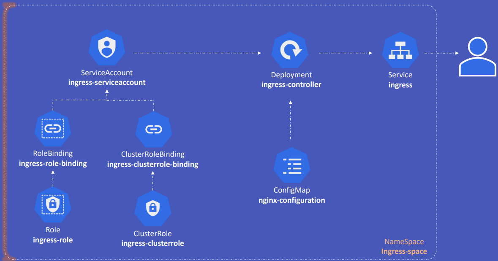
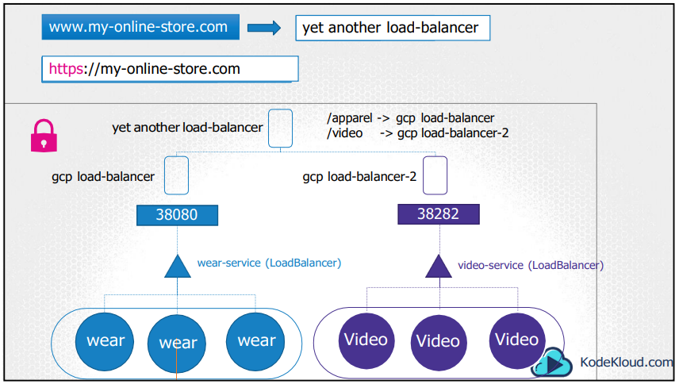

# Ingress
- Ingress is a Kubernetes resource that exposes HTTP and HTTPS routes from outside the cluster to services within the cluster. Traffic routing is controlled by rules defined on the Ingress resource.
- Ingress is not a service type, but rather a resource that manages external access to services in a cluster.
- provides users a single point of entry to access services within a cluster 
- can also implment SSL security, name-based virtual hosting, authentication, and path-based routing, among other things

# Big Picture

# Ingress Architecture
- The image above shows the architecture of an Ingress in an application
- Ingress handles the top 3 rectangles (load balancers) inside kubernetes (box)

# Ingress Controller
- An Ingress Controller is a daemon that runs in a Kubernetes cluster and watches for Ingress resources to create load balancers and route traffic to the appropriate services. 
- examples: GCE, Nginx, Traefik, HAProxy, Contour, Istio and Envoy
- GCE and Nginx are the most popular Ingress Controllers in use today
    - both are being supported and maintained by the Kubernetes community
- a kubernetes cluster does not come with an Ingress Controller by default, so you must install one yourself (above examples)

# Ingress Resources
- Ingress resources are used to define how external traffic is routed to services within the cluster (rules)
    - rules are defined using hostnames and paths to match incoming requests to services within the cluster 
    - example: www.my-online-store.com/wear is routed to the `wear` service while www.my-online-store.com/electronics is routed to the `electronics` service
    - example 2: wear.my-online-store.com is routed to the `wear` service while electronics.my-online-store.com is routed to the `electronics` service
- Ingress resources are defined in YAML files and are created using the `kubectl apply -f <filename>` command

# What is a daemon?
- a daemon is a background process that runs continuously and performs specific tasks within the cluster. Daemons are essential for maintaining the functionality and health of the cluster. They typically handle system-level tasks that need to be performed on all or a subset of nodes.

## Examples of daemons in Kubernetes:
1. Kubelet: The primary node agent that runs on each node. It ensures that containers are running in a Pod and reports the status of the node and its pods to the Kubernetes control plane.
2. Kube-proxy: A network proxy that runs on each node. It maintains network rules on nodes, allowing network communication to your Pods from network sessions inside or outside of your cluster.
3. Ingress Controller: A daemon that watches for Ingress resources and configures the load balancer to route traffic to the appropriate services. Examples include Nginx, Traefik, and HAProxy.
4. DaemonSet: A Kubernetes resource that ensures a copy of a specific Pod runs on all (or some) nodes. It is used to deploy daemons like log collectors, monitoring agents, or other system-level services.

## Characteristics of daemons in Kubernetes:
- Continuous Operation: Daemons run continuously in the background, performing their tasks without user intervention.
- System-Level Tasks: They handle tasks that are essential for the operation and management of the cluster, such as monitoring, logging, networking, and load balancing.
- Node-Specific: Some daemons, like those managed by DaemonSets, run on specific nodes or all nodes in the cluster to ensure consistent functionality across the cluster.

<!-- Ingress updates 
https://kubernetes.io/docs/reference/generated/kubectl/kubectl-commands#-em-ingress-em-
https://kubernetes.io/docs/concepts/services-networking/ingress
https://kubernetes.io/docs/concepts/services-networking/ingress/#path-types 
-->
<!-- available during the exam:
 https://helm.sh/docs/
 https://kubernetes.io/docs/
 https://github.com/kubernetes/
 https://kubernetes.io/blog/ 
 -->

 114.48 + 18.55 + 23.95 + 2.03 = 159.01