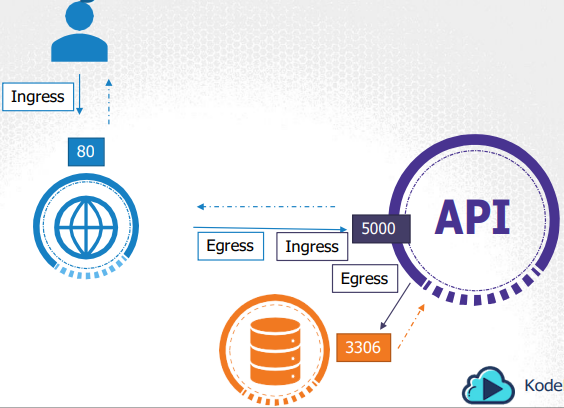

# Ingress vs Egress
- Ingress refers to incoming traffic to a service in a cluster
- Egress refers to outgoing traffic from a service in a cluster


- The image may be confusing. but the arrow pointing from the app (blue) to the api (purple) is both ingress and egress traffic
    - Ingress because the app is sending traffic to the api
    - Egress because the api is receiving traffic from the app

# Network Security Policies
- by default, all pods can communicate with each other
- in the image above what if we do not want the app (blue) to communicate with the database (orange)?
    - we can use Network Policies to restrict communication between pods
    - We define a Network Policy for the database pod:
        - Allow Ingress traffic from API Pod on Port 3306
        - this will block anything else 
    - use labels and selectors to define which pods the policy applies to
- Not all Kubernetes distributions support Network Policies
    - GKE, AKS, and EKS support Network Policies
    - Kube-router, Calico, Romana, and Weave support Network Policies
    - Minikube does not support Network Policies
    - Flannel does not support Network Policies (might have changed -old video)

# Example:
- using the defined information above:

```yaml
apiVersion: networking.k8s.io/v1
kind: NetworkPolicy
metadata:
    name: db-policy
spec:
    podSelector:
        matchLabels:
            role: db
    policyTypes:
    # Egress traffic is blocked, except for responses to the API Pod request
    # Once you allow Ingress traffic, the policy automatically allows for a response (Egress) to the request (Ingress)
    # Also the db pod cannot make a request to the api pod because the policy only allows Ingress traffic from the api pod. A specific Egress rule must be defined for that.
    - Ingress
    # part 2, Egress rule
    - Egress
    ingress:
    - from:
        # podSelector and namespaceSelector are in the same value of the list (- ) which means both must be true for the rule to apply, but "- ipBlock" has a different value, which means it is a separate rule. 
        # This specifies that it must have the label role: api-pod and namespace: prod to allow Ingress traffic or have the IP address given in the ipBlock field
        - podSelector:
            matchLabels:
                role: api-pod
        # This specifies that only traffic from the specific namespace prod is allowed, if not specified, traffic from all namespaces is allowed
          namespaceSelector:
            matchLabels:
                name: prod
        # What if we had a backup server that needed to access the database? it is not in the same namespace (prod) or labeled (role: api-pod). We do know the IP address of the backup server, so we can use the IPBlock field to allow the backup server to access the database by allowing Ingress traffic from the backup server's IP address
        - ipBlock:
            cidr: 192.168.5.10/32
      ports:
      - protocol: TCP
        port: 3306 # this is the port the database is listening on
# part 2, Egress rule
# what if we had a service inside the db pod that sends data to the backup server from the database?
# we can define an Egress rule to allow the db pod to send data to the backup server
    egress:
      - to:
        - ipBlock:
            cidr: 192.168.5.10/32
        ports:
        - protocol: TCP
          port: 80 # this is the port the backup server is listening on
# if we want to have multiple to's we need to define them in separate rules
      - to:
        - podSelector:
            matchLabels:
                role: backup-server
        ports:
        - protocol: TCP
          port: 80 # this is the port the backup server is listening on
```

name=payroll
