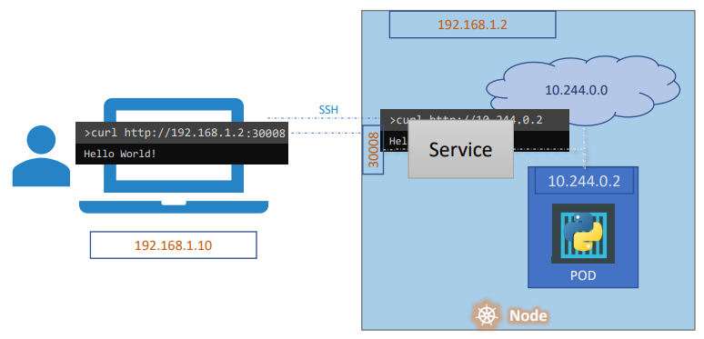

# Services
- allow for communication between different components within and outside the application 
- provides loosely coupled architecture between components in our application architecture


# Service Architecture
- the image above shows the architecture of a service in an application
- as you can see, the service is the middleman, exposing an API that redirects requests to the appropriate component (pod)
    - The serivce API is exposed at 192.168.1.2:30008 (NodePort) in this case to the outside world 
        - the NodePort has a range of 30000-32767
    - The service internally redirects the request to 10.244.0.2:80 (TargetPort), which is the pod that is running the application
    - The service has 10.106.1.12:80 (Port) as its internal IP address that is used to link the NodePort and TargetPort together (shown in a different image)
```yaml
apiVersion: v1
kind: Service
metadata:
  name: myNodeService # expose the service to the outside world
spec:
    type: NodePort
    selector:
        app: myapp
    ports:
    - protocol: TCP
      port: 80
      targetPort: 80
      nodePort: 30080
```


# Types of Services
- if multiple pods are running with the same labels, the service will load balance the traffic between them automatically using random selection by default
    - this also works when there are multiple nodes in the cluster and the pods are running on different nodes 

## ClusterIP
- Exposes the service on a cluster-internal IP
- Only reachable within the cluster
- This is the default service type
```yaml
apiVersion: v1
kind: Service
metadata:
  name: back-end
spec:
  type: ClusterIP
  ports:
  - port: 8080 # port on the service other pods will use to access the service
    targetPort: 80 # port on the pod
  selector:
    app: myapp-pod
    type: back-end
---
apiVersion: v1
kind: Pod
metadata:
  name: myapp-pod
  labels:
    app: myapp-pod
    type: back-end
spec:
  containers:
  - name: myapp-container
    image: myapp-image
    ports:
    - containerPort: 80
```

## NodePort
- Exposes the service on each Node's IP at a static port
- A service of type NodePort is accessible from outside the cluster
- In Kubernetes, you might need multiple ports for a service for several reasons:
    - Different Protocols: Your application might use different protocols that require separate ports. 
        - For example, you might have HTTP traffic on port 80 and HTTPS traffic on port 443.
    - Multiple Services: A single service might expose multiple internal services. 
        - For example, a web application might expose a web server on port 80 and an API server on port 8080.
            - like microservices
    - Backward Compatibility: You might need to support legacy systems that require different ports.
    - Load Balancing: You might want to distribute traffic across different ports for load balancing purposes.

```yaml
apiVersion: v1
kind: Service
metadata:
  name: frontend
  labels:
    app: myapp
spec:
  type: NodePort
  ports:
    - port: 80 
      targetPort: 80
      nodePort: 30080 # if you don't specify a nodePort, Kubernetes will assign one automatically from the range 30000-32767
    - port: 443
      targetPort: 443
  selector: # you use the deployment file under the spec.template.metadata.labels section, not the metadata.labels section (you use the metadata.labels section for Pod files) 
    app: myapp
```

## LoadBalancer
- Exposes the service externally using a cloud provider's load balancer
- It is a NodePort service with additional features

