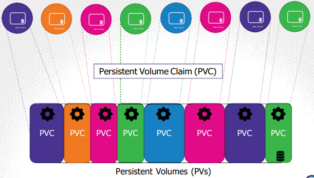

# Volumes
- [Kubernetes Documentation on Persistent Volumes](https://kubernetes.io/docs/concepts/storage/persistent-volumes/#claims-as-volumes)
- **Docker**: By its nature, Docker containers are designed to be temporary. When a container is stopped, the data is lost. To persist data, we need to use volumes. By creating a volume, we can store data outside of the container, and the data will persist even if the container is stopped or deleted. When a new container is created, it can use the same volume to access the data (old or new).
- **Kubernetes**: Similar to Docker, pods are designed to be temporary. When a pod is deleted, the data is lost. To persist data, we need to use volumes. By creating a volume, we can store data outside of the pod, and the data will persist even if the pod is deleted. When a new pod is created, it can use the same volume to access the data (old or new).
    - The data (volume) is stored on the node. We do this by declaring a volume in the `pod.spec.volumes` field. You declare where on the node the volume is stored.
    - For the pod/container to access the volume, we need to mount the volume to the pod. We do this by declaring a `volumeMount` in the `pod.spec.containers.volumeMounts` field. You declare where in the container the volume is mounted.
        - Notice that the container is not accessing `/data`. Because `/data` is being mounted to `/opt` in the container, the container is accessing `/opt`.
            - The data at `/opt` if changed will be reflected in `/data`, and vice versa.

    - Example:
        ```yaml
        apiVersion: v1
        kind: Pod
        metadata:
            name: mypod
        spec:
            containers:
            - name: mycontainer
              image: nginx
              volumeMounts:
              - mountPath: /opt
                name: myvolume
            volumes:
            - name: myvolume
              # Can use hostPath, emptyDir, or network storage solutions like NFS, iSCSI, Flocker, GlusterFS, ScaleIO, AWS, or Ceph
              # emptyDir: Storage is tied to the pod. If the pod is deleted, the data is deleted.
              # hostPath: Storage is tied to the node. If the pod is deleted, the data persists.
              # fc (Fibre Channel): High-speed network technology that can connect servers to storage area networks (SANs)
                # High-speed, high-reliability, and low-latency, but expensive and complex to set up.
                # Block storage, not file storage, and persistent storage (data persists even if the pod is deleted)
              hostPath: 
                path: /data
                type: Directory
        ```

- If the same `/data` is being used on multiple nodes, we do not want to use `hostPath`. We want to use a network storage solution like NFS, iSCSI, Flocker, GlusterFS, ScaleIO, AWS, or Ceph.
    - This way, the data is stored on a network storage solution, the pod can access the data from any node, and the data will persist even if the pod is deleted, and the data will be the same across all nodes.
    - Example if using AWS EBS (Elastic Block Storage):
        ```yaml
        apiVersion: v1
        kind: Pod
        metadata:
            name: mypod
        spec:
            containers:
            - name: mycontainer
              image: nginx
              volumeMounts:
              - mountPath: /opt
                name: myvolume
            volumes:
            - name: myvolume
              awsElasticBlockStore:
                volumeID: <volume-id>
                fsType: ext4
        ```

# Persistent Volumes and Persistent Volume Claims
- Used to manage storage in a cluster, rather than on a node.
- A Persistent Volume (PV) is a piece of storage in the cluster that has been provisioned by an administrator. This volume can be used by any pod in the cluster by using a Persistent Volume Claim (PVC).
- A Persistent Volume Claim (PVC) is a request for storage by a user. It is similar to a pod requesting CPU and memory.

- **Advantages**:
    - Decouples storage from the pod
    - Storage is managed by the cluster, not the pod
    - Storage is persistent
    - Storage can be shared between pods
- **Disadvantages**:
    - More complex to set up
    - More complex to manage
    - More complex to troubleshoot

- Example:
    - Create a Persistent Volume (PV) and Persistent Volume Claim (PVC) in the cluster
        ```yaml
        apiVersion: v1
        kind: PersistentVolume
        metadata:
            name: mypv
        spec:
            capacity:
                storage: 1Gi
            accessModes:
            # ReadWriteOnce: The volume can be mounted as read-write by a single node
            # ReadOnlyMany: The volume can be mounted read-only by many nodes
            # ReadWriteMany: The volume can be mounted as read-write by many nodes
                - ReadWriteOnce 
            hostPath:
            # This method is not recommended for production, as the data is stored on the node
            # For production, use a network storage solution like NFS, iSCSI, Flocker, GlusterFS, ScaleIO, AWS, or Ceph as discussed earlier. 
                path: /tmp/data
        ```

    - Create a Persistent Volume Claim (PVC) in the cluster
        ```yaml
        apiVersion: v1
        kind: PersistentVolumeClaim
        metadata:
            name: mypvc
        spec:
            accessModes:
                - ReadWriteOnce
            resources:
                requests:
                    storage: 1Gi
        ```

- The PVC will automatically bind to a PV that meets the requirements (accessModes, storage, etc.) provided in the PVC.
    - If multiple PVs meet the requirements, the PVC will bind to the PV with the smallest capacity.
        - But there is a 1 to 1 relationship between a PVC and a PV, which means any excess capacity in the PV will not be used by the PVC (wasted).
    - If no PVs meet the requirements, the PVC will remain unbound.
    - If multiple PVCs are requesting the same PV, the PVC that was created first will bind to the PV. The other PVCs will remain unbound.
    - If a PVC is deleted, the PV will not be deleted by default (persistentVolumeReclaimPolicy: Retain). The PV will be available for other PVCs to bind to.
        - Set claim to Delete to delete the PV when the PVC is deleted.
        - Set claim to Recycle to delete the data in the PV when the PVC is deleted, but the PV will remain.
    - You can manually bind a PVC to a PV by specifying the PV name in the `PVC.spec.volumeName` field.
        ```yaml
        apiVersion: v1
        kind: PersistentVolumeClaim
        metadata:
            name: mypvc
        spec:
            accessModes:
                - ReadWriteOnce
            resources:
                requests:
                    storage: 1Gi
            volumeName: mypv
        ```
        - Or by using labels and selectors
            ```yaml
            apiVersion: v1
            kind: PersistentVolumeClaim
            metadata:
                name: mypvc
            spec:
                accessModes:
                    - ReadWriteOnce
                resources:
                    requests:
                        storage: 1Gi
                selector:
                    matchLabels:
                        type: local
            ```

- Example of a pod using a PVC
    ```yaml
    apiVersion: v1
    kind: Pod
    metadata:
        name: mypod
    spec:
        containers:
        - name: mycontainer
          image: nginx
          volumeMounts:
          - mountPath: /opt
            name: myvolume
        volumes:
        - name: myvolume
          persistentVolumeClaim:
            claimName: mypvc
    ```